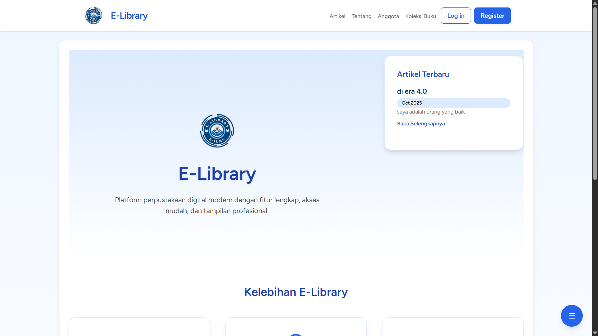

# 👋 Hi there! I'm Achmad Muzammi Fahmi

Welcome to my GitHub profile!
 

## 🎓 Education
- **Universitas Negeri Malang**  
- **MA Al Maarif Singosari**   

## 🚀 Languages & Technologies  

## 📫 How to Reach Me
- 📧 Email: muzammifahmi1@gmail.com
- 💼 LinkedIn: [Achmad Muzammi Fahmi](https://www.linkedin.com/in/achmad-muzammi-fahmi-09800a297)

## 💼 Projects

  
<b>📚 E-Library — Digital Library Management System</b>

   
     
  The E-Library is a web-based library management system designed to streamline book data management and improve accessibility for both librarians and users.

  **🛠️ Technologies Used:**  
  `Laravel` `MySql` `Tailwind`  

  🔗 **Repo:**  
  https://github.com/muzammifahmi/E-LIBRARY.git

## Motto
- إذا مات ابنُ آدمَ انقطع عملُه إلا من ثلاثٍ: صدقةٍ جاريةٍ ، أو علمٍ يُنتفَعُ به، أو ولدٌ صالحٌ يدعو له

     

<!---
muzammifahmi/muzammifahmi is a ✨ special ✨ repository because its `README.md` (this file) appears on your GitHub profile.
You can click the Preview link to take a look at your changes.
--->
